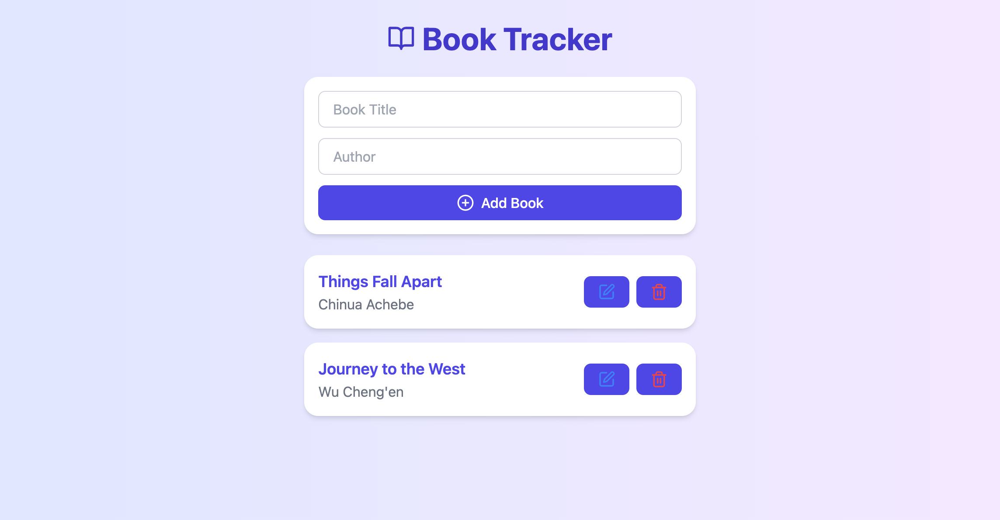

# Multi-Service Docker Application – Book Tracker App

## Overview

This project demonstrates a multi-service Docker application simulating a realistic production environment. The application allows users to manage a personal reading list with a React frontend, Node.js/Express backend, MongoDB database, and Nginx reverse proxy. A Redis cache is included to demonstrate caching capabilities.

The goal is to showcase advanced Docker concepts, including multi-stage builds, custom base images, networks, volumes, secrets, health checks, logging, and optimized containerization.

## Features

- Web Application (React + Vite)

    - Add, view, edit, and delete books from your reading list.

    - Fully responsive UI with animations using Framer Motion.

    - Multi-stage Docker build to minimize image size.

- API Service (Node.js + Express)

    - RESTful API for managing books.

    - TypeScript implementation for type safety.

    - Custom Docker image with built TypeScript compiled into JavaScript.

- Database (MongoDB)

    - Persistent storage of books.

    - Data volume ensures persistence between container restarts.

    - Mongo Express interface available for administration.

- Reverse Proxy (Nginx)

    - Serves the React frontend.

    - Proxies API requests to the backend.

    - Configurable for production routing, caching, and load balancing.

- Redis Cache (Optional)

    - Can be added for performance improvement.

    - Demonstrates multi-service communication.

## Architecture Diagram
```pgsql
+--------------------+          +--------------------+
|   React Frontend   | <--HTTP--> |      Nginx Proxy   |
|   (Web Service)    |           | (Reverse Proxy)   |
+--------------------+          +--------------------+
                                       |
                                       |
                                 HTTP /api
                                       |
                                       v
                              +--------------------+
                              |  Node.js Backend   |
                              |  (API Service)     |
                              +--------------------+
                                       |
                                       v
                              +--------------------+
                              |     MongoDB        |
                              | (Persistent Data)  |
                              +--------------------+
                                       |
                                       v
                               +---------------+
                               |   Redis Cache  |
                               +---------------+
```
# Getting Started
## Prerequisites

- Docker (version 20+)
- Docker Compose (version 1.29+)
## Project Structure
```pgsql
book-tracker-app/
├── docker-compose.yml
├── img/
├── nginx/
│   └── default.conf
├── web/
│   ├── Dockerfile
│   ├── src/
│   ├── index.html
│   ├── package.json
│   ├── postcss.config.js
│   ├── tailwind.config.js
│   ├── tsconfig.json
│   ├── vite.config.ts
│   └── dist/
├── server/
│   ├── Dockerfile
│   ├── package.json
│   ├── tsconfig.json
│   └── server.ts
└── README.md
```
## Setup Instructions

1. Clone the repository
```bash
git clone <repository-url>
cd book-tracker-app
```
2. Build and run all services
```bash
docker-compose up --build
```
3. Access the services

- Frontend React app: http://localhost

- API endpoints: http://localhost/api/books

- Mongo Express: http://localhost:8081
## Docker Details
1. Web Service (React)

    - Multi-stage Docker build reduces final image size.

    - Base image: node:18-alpine for build stage, nginx:alpine for serving static files.

    - VITE or CRA build placed into /usr/share/nginx/html.

    - Nginx serves frontend and proxies /api to backend.

2. Server (API)

    - Base image: node:18-alpine.

    - TypeScript compiled into JavaScript (dist/ folder) in Docker.

    - Environment variables managed through Docker Compose (e.g., MONGO_URI).

    - Exposes port 4000.

3. MongoDB

    - Official mongo:5 image.

    - Persistent volume mongo-data for database storage.

    - Accessible to API container via internal Docker network.

4. Nginx

    - Serves React static files and proxies API requests.

    - Configurable for health checks, caching, and logging.

    - Custom default.conf includes proxy rules.

5. Docker Compose

    - Defines networks and service dependencies.

    - Handles environment variables, volumes, and port mappings.

    - Ensures services start in correct order (depends_on).

## Best Practices Implemented

- Multi-stage builds for smaller image sizes.

- Custom base images for both frontend and backend.

- Docker network ensures inter-container communication.

- Volumes for persistent database storage.

- Environment variables for sensitive information.

- Health checks for backend and database services.

- Optimized Dockerfiles for minimal layers and fast builds.

- Logging via Nginx and Node.js for monitoring.

## Running in Development

For faster iteration, you can run frontend and backend separately:
```bash
# Backend with hot reload
cd server
npm install
npm run dev

# Frontend with hot reload
cd web
npm install
npm run dev
```
API calls to /api/books should work locally with proper proxy configuration in React.

## Contributing

1. Fork the repository.

2. Create a feature branch:
```bash
git checkout -b feature/new-feature
```

3. Commit changes: 
```bash
git commit -m "Add new feature"
```

4. Push to branch: 
```bash
git push origin feature/new-feature
```

5. Open a Pull Request.

## License

MIT License © 2025